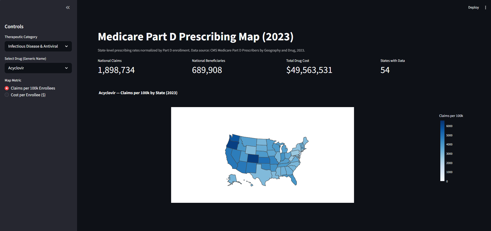
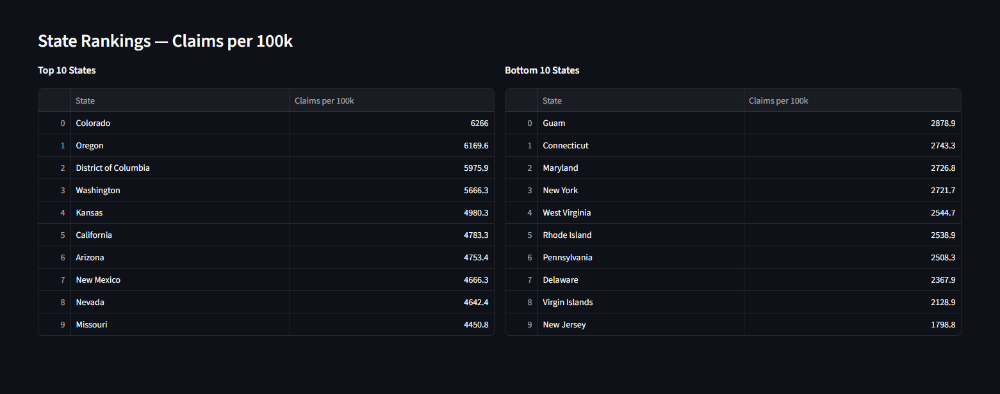

# CMS Medicare Part D — Geographic Drug Surveillance

A geographic disease burden surveillance tool built on Medicare Part D prescribing data. By mapping per-capita drug utilization across U.S. states, the project uses prescribing patterns as a proxy for regional disease prevalence — an approach used in pharmacoepidemiology and environmental health research to generate hypotheses about where and why certain conditions cluster.

## Streamlit App

An interactive web application allows dynamic exploration of any drug in the dataset. Users select a drug by therapeutic category, toggle between claims per 100k enrollees and cost per enrollee, and view a choropleth map alongside state rankings.

**Live app:** [medicare-prescriptions-geography-application.streamlit.app](https://medicare-prescriptions-geography-application-zck4gvqcmtyvgacnc.streamlit.app/)

To run locally:

```bash
py -m streamlit run app.py
```





## Analytical Approach

Raw claim counts reflect population size and are not analytically meaningful for geographic comparison. All metrics are normalized by state-level Part D enrollment to produce per-capita rates, revealing true variation in prescribing access and disease burden.

Geographic prescribing clusters can reflect:

- Regional variation in disease prevalence driven by environmental, occupational, or demographic exposures
- Access to specialty care and prescribing infrastructure
- Socioeconomic and insurance coverage patterns

This tool surfaces those signals for further investigation. Caution is required when interpreting results — prescribing patterns do not establish causation and are subject to confounding by age distribution, access to care, and coding variation.

## Project Structure

```
app.py                                           # Streamlit web application
notebooks/
├── 00_build_database.ipynb                      # Data ingestion — loads CSVs into SQLite
├── 01_data_exploration.ipynb                    # Dataset structure, coverage, suppression
├── 02_case_study/
│   ├── 01_drug_selection.ipynb                  # Methodology: drug selection and normalization
│   └── 02_geographic_map.ipynb                  # Methodology: choropleth map construction
└── 03_antipsychotic_analysis/
    └── 01_antipsychotic_explore.ipynb           # Hypothesis-driven geographic analysis
```

## Case Study: Lenalidomide (Revlimid)

Lenalidomide is an oral immunomodulatory agent used almost exclusively for multiple myeloma. In 2023 it was the highest-cost drug in Medicare Part D at **$3.86 billion** nationally, with approximately **$104,000 spent per beneficiary per year**. Because it is single-indication, its prescribing geography serves as a reasonable proxy for regional multiple myeloma treatment access.

**Interactive map:** [lenalidomide_map.html](notebooks/02_case_study/lenalidomide_map.html)

## Hypothesis Testing: Antipsychotic Geographic Variation

Antipsychotic prescribing shows notable geographic variation across U.S. states. This analysis investigates whether that variation is explained by rurality or socioeconomic factors using two external datasets.

**Approach:** Antipsychotics are divided into three groups — oral generics, long-acting injectables (LAIs), and clozapine — and analyzed separately. Spearman correlations are computed between state-level prescribing rates and two candidate predictors: USDA Rural-Urban Continuum Codes (rurality) and CMS dual-eligibility rates (socioeconomic status).

**Findings:**
- Pairwise correlations between drug groups are moderate (r = 0.32 to 0.52), confirming that geographic variation is real but each group has distinct drivers
- Rurality shows effectively zero correlation with prescribing rates across all three groups (r ≈ 0), rejecting the rural isolation hypothesis
- Dual-eligibility rate also shows no significant correlation at the state level (r ≈ 0)
- The null results point to state-level aggregation as too coarse to detect the underlying signal — county-level analysis would be required to test these hypotheses properly

**External datasets used:**
- USDA Rural-Urban Continuum Codes 2023 (county-level rurality classification)
- CMS Medicare Monthly Enrollment 2023 (dual-eligibility counts by state)

## Data Sources

**Medicare Part D Prescribers by Geography and Drug (2023)**
CMS public use file — one row per drug per geographic unit, with total claims, beneficiaries, prescribers, and drug cost. Available at [data.cms.gov](https://data.cms.gov).

**Medicare Monthly Enrollment (2023)**
CMS state-level Part D enrollment counts used for per-capita normalization and dual-eligibility analysis. Available at [data.cms.gov](https://data.cms.gov).

**USDA Rural-Urban Continuum Codes (2023)**
County-level rurality classification used to compute population-weighted state rurality index. Available at [ers.usda.gov](https://www.ers.usda.gov).

Raw data files are excluded from this repository via `.gitignore` due to size.

## Tools

Python, pandas, SQLite, Plotly, Streamlit

## Setup

1. Download source CSVs from data.cms.gov and place in `data/`
2. Run `00_build_database.ipynb` to build the local SQLite database
3. Launch the app with `py -m streamlit run app.py`, or run the notebooks in order